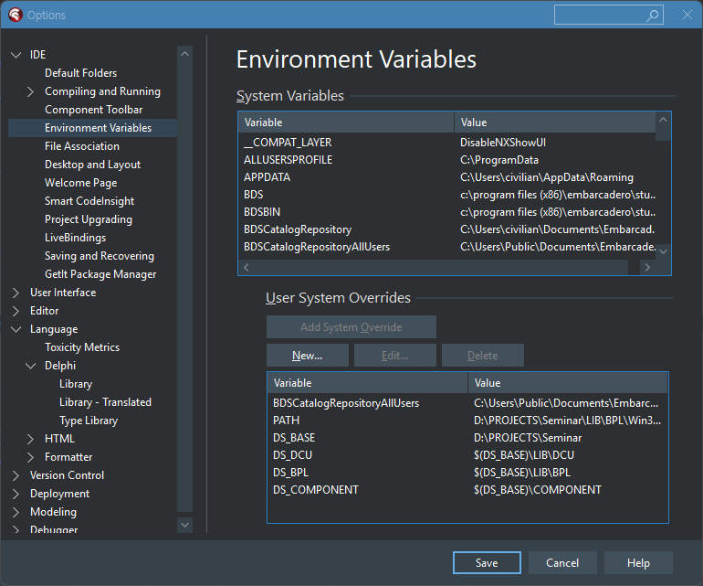
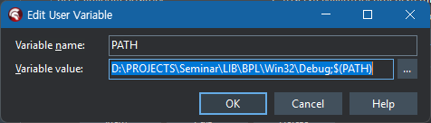
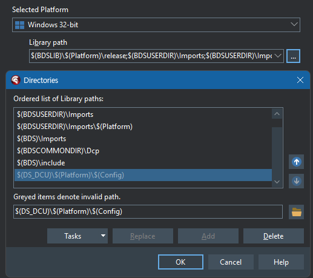

## 델파이 환경변수 설정방법

### 왜 환경변수를 사용하는가?

+ 개발자 마다 프로젝트관련 파일의 위치가 다를 수 있다
  + A는 C:\Work가 기본
  + B는 D:\Work\Project가 기본
+ 이런 물리적으로 다른 환경을 직접 다루면, 위치가 제각각 다르므로 문제가 생긴다
+ 가상의 이름을 정해놓고, 개발자들은 가상의 이름으로 접근한다
+ 가상의 이름이 실제 이름으로 변경될 때에는 설정한 값에 따라 바뀌므로 문제가 사라진다

### 델파이 환경변수 만들기

Tools -> Options -> Environment 를 선택

  

+ DS_BASE
  프로젝트의 물리적인 기본 경로를 의미한다(사용자별로 다를 수 있다)
+ DS_DCU
  컴파일된 유닛이 생성될 경로
+ DS_BPL
  컴파일된 패키지 라이브러리가 생성될 경로
+ DS_COMPONENT
  컴포넌트의 소스코드가 있는 기본 경로

### Path 등록하기

델파이 패키지가 생성되는 경로는 PATH에 등록해야 하며, 등록하지 않는 경우에는
패키지 설치시 경로를 찾지못한다는 오류가 발생한다

### 라이브러리 경로 추가하기

컴파일된 유닛들이 있는 위치를 알려주어야 링크시 참조할 수 있다
개발하고자 하는 타겟 OS별로 모두 등록해주어야 한다.

$(DS_DCU)\$(Platform)\$(Config) 를 추가한다

### 델파이 패키지의 종류

+ 런타임
  프로그램의 기능을 구현하기 위한 라이브러리
+ 디자인타임
  패키지를 델파이에 등록하고, 개발자의 편의성을 증진하기 위한 것. 디자인타임에서만 사용

