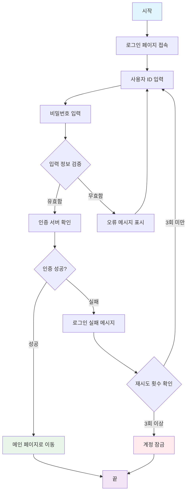

### 델파이 리눅스 환경설정

#### WSl 버전 확인

```shell
PS D:\> wsl --version
WSL 버전: 2.5.9.0
커널 버전: 6.6.87.2-1
WSLg 버전: 1.0.66
MSRDC 버전: 1.2.6074
Direct3D 버전: 1.611.1-81528511
DXCore 버전: 10.0.26100.1-240331-1435.ge-release
Windows 버전: 10.0.26100.4484
```

#### WSL 설치

```shell
PS D:\> wsl --list --online
다음은 설치할 수 있는 유효한 배포 목록입니다.
'wsl.exe --install <Distro>'을 사용하여 설치합니다.

NAME                            FRIENDLY NAME
AlmaLinux-8                     AlmaLinux OS 8
AlmaLinux-9                     AlmaLinux OS 9
AlmaLinux-Kitten-10             AlmaLinux OS Kitten 10
AlmaLinux-10                    AlmaLinux OS 10
Debian                          Debian GNU/Linux
FedoraLinux-42                  Fedora Linux 42
SUSE-Linux-Enterprise-15-SP6    SUSE Linux Enterprise 15 SP6
SUSE-Linux-Enterprise-15-SP7    SUSE Linux Enterprise 15 SP7
Ubuntu                          Ubuntu
Ubuntu-24.04                    Ubuntu 24.04 LTS
archlinux                       Arch Linux
kali-linux                      Kali Linux Rolling
openSUSE-Tumbleweed             openSUSE Tumbleweed
openSUSE-Leap-15.6              openSUSE Leap 15.6
Ubuntu-18.04                    Ubuntu 18.04 LTS
Ubuntu-20.04                    Ubuntu 20.04 LTS
Ubuntu-22.04                    Ubuntu 22.04 LTS
OracleLinux_7_9                 Oracle Linux 7.9
OracleLinux_8_7                 Oracle Linux 8.7
OracleLinux_9_1                 Oracle Linux 9.1
PS D:\>
```

#### Ubuntu 22.04 설치하기
```shell
wsl --install Ubuntu-22.04
```

#### 설치 후 업데이트

##### 업데이트 가능목록 확인 
```shell
sudo apt --upgradable
```

##### 리포지토리 업데이트
```shell
sudo apt update
```

##### 업데이트 실행
```shell
sudo apt upgrade
```

#### 필수 도구 설치

```shell
sudo apt install net-tools
sudo apt install inetutils-telnet
sudo apt install ufw 
```

##### 기본 개발도구 설치
```shell
sudo apt install -y build-essential
```

#### PAServer 설치

##### PAServer 복사 및 설치
```shell
cd ~
cp "/mnt/c/Program Files (x86)/Embarcadero/Studio/23.0/PAServer/LinuxPAServer23.0.
tar.gz" . 

tar -xvf LinuxPAServer23.0.tar.gz
```

##### WSL 아이피 확인하기
```shell
ifconfig
```

##### WSL 네트워크 설정
```
# C:\Users\사용자명\.wslconfig
networkingMode=mirrored
localhostForwarding=true
```

$ sudo vi /etc/wsl.conf
[boot]
systemd=true

##### PAServer 실행

```shell
cd PAServer-23.0/
./paserver
```



데이터베이스 스키마
```
--
-- 사용자 마스터
--
DROP TABLE IF EXISTS USRS;
CREATE TABLE USRS (
	SEQ INTEGER NOT NULL AUTO_INCREMENT PRIMARY KEY COMMENT '일련번호',
	USR_ID VARCHAR(12) NOT NULL COMMENT '사용자 아이디',
	USR_PW VARCHAR(64) NOT NULL COMMENT '접속 비밀번호',
	USR_NM VARCHAR(20) NOT NULL COMMENT '사용자 성명',
	USR_LVL INTEGER NOT NULL DEFAULT 0 COMMENT '사용자 등급',
	LGN_CNT INTEGER DEFAULT 0 COMMENT '로그인 횟수',
	LGN_FAIL_CNT INTEGER DEFAULT 0 COMMENT '로그인 실패횟수',
	LST_LOGIN_DT DATETIME COMMENT '최종 로그인 일시',
	LST_LOGIN_IP VARCHAR(15) COMMENT '최종 로그인 아이피',
	LST_LOGOUT_DT DATETIME COMMENT '최종 로그아웃 일시',
	USE_YN VARCHAR(1) DEFAULT 'N' COMMENT '삭제 여부',
	CRT_ID VARCHAR(20) DEFAULT 'SYSTEM' COMMENT '생성자 아이디',
	CRT_DT TIMESTAMP DEFAULT CURRENT_TIMESTAMP() COMMENT '생성일시',
	CRT_IP VARCHAR(15) COMMENT '생성자 아이피',
	MOD_ID VARCHAR(20) COMMENT '수정자 아이디',
	MOD_DT TIMESTAMP ON UPDATE CURRENT_TIMESTAMP() COMMENT '수정일시',
	MOD_IP VARCHAR(15) COMMENT '수정자 아이피'
);
CREATE INDEX IDX_USRS_USER_ID ON USRS(USR_ID);
```

